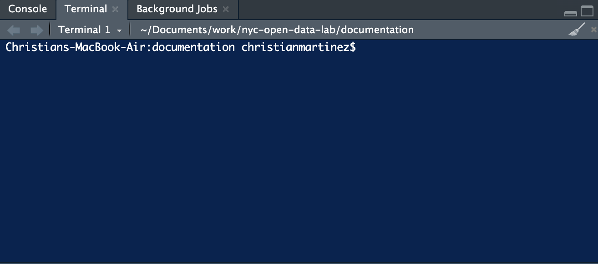

# Getting Started

Before customizing the OpenData template, you'll need a working R package project connected to GitHub. This chapter walks through creating a new package, connecting it to a GitHub repository, and preparing it to use the OpenData template.

## Creating a New Package

In RStudio, select File → New Project. Then:

1.  Choose **New Directory**.
2.  Select **R Package**.
3.  Enter a package name.
4.  Choose the directory where the package should be created.
5.  Click **Create Project**.

::: {callout-tip}
### Making Things Easier:

If Git is installed on your computer, you may also see an option to Create a git repository. Checking this box will automatically initialize Git for the project, allowing you to skip Step 2 below.
:::

## Connecting to GitHub

Version control is an essential part of modern R package development. Throughout this guide, Git and GitHub are used to track changes, collaborate with others, host package source code, and publish package websites using GitHub Pages.

Fortunately, only a small subset of Git functionality is needed to build an OpenData package.

::: callout-tip
### Here are the steps in order. A more thorough explanation is provided as well.

1.  Create repository
2.  git init
3.  git status
4.  git remote add origin https://github.com/USERNAME/nycOpenData.git
5.  git remote -v
6.  git add .
7.  git commit -m "Initial package template"
8.  git branch -M main
9.  git push -u origin main
:::

### Step 1: Create a GitHub Repository

Begin by logging into GitHub and creating a new repository.

When creating the repository:

- Give the repository the same name as your package (for example, `nycOpenData`).
- Keep the repository **Public** if you plan to share the package.
- Do **not** initialize the repository with a README, `.gitignore`, or license if you already created the package locally. These files already exist in your package.

Once the repository has been created, copy its URL.

For example:

``` text
https://github.com/USERNAME/nycOpenData.git
```

### Step 2: Initialize Git

Open your package project in RStudio.

If Git was not enabled when the project was created, initialize it from the Terminal:

``` text
git init
```

Then verify Git is active:

``` text
git status
```

::: callout-tip
#### Where is the Terminal in RStudio?

So far, you may have primarily worked in the **R Console**, where you run R commands such as:

``` r
mean(x)
library(tidyverse)
```

Git commands are different. Commands such as `git init`, `git status`, and `git push` are **not R commands**. They are commands that you run through your computer's **Terminal**.

In RStudio, the Terminal is conveniently built into the interface and can usually be found in the same pane as the Console.

**A simple rule to remember:**

- **R Console** → Run R code.
- **Terminal** → Run system commands, including Git commands.

For example:

``` r
# Run this in the R Console
library(tidyverse)
```

``` bash
# Run this in the Terminal
git status
```

You do not need to become a command-line expert to use this guide. We will only use a small number of Terminal commands, primarily for working with Git and GitHub.

The image below shows where you can find the Terminal in RStudio:


:::

### Step 3: Connect the Local Package to GitHub

Add the GitHub repository as the remote origin.

``` text
git remote add origin https://github.com/USERNAME/nycOpenData.git
```

Verify the connection:

``` text
git remote -v
```

You should now see the GitHub repository listed as the remote.

### Step 4: Make Your First Commit

Stage every file:

``` text
git add .
```

Commit them:

``` text
git commit -m "Initial package template"
```

### Step 5: Push to GitHub

Push the package to GitHub

``` text
git branch -M main
git push -u origin main
```

After refreshing GitHub, your package should now appear online.

### Daily Workflow

After the initial setup, the Git workflow is very simple.

Whenever you finish making changes:

``` text
git add .
git commit -m "Describe what changed"
git push
```

Most OpenData package development only requires these three commands.

At this point, your package structure is complete and connected to GitHub. The final step is to replace the default package files with the OpenData template.

### Updating an Existing Package

If you already cloned a package from GitHub and someone else has made changes, download the latest updates before beginning your work.

``` text
git pull
```

### Working with Branches and Undoing Common Actions

The basic `git add`, `git commit`, and `git push` workflow will handle most package development. However, when collaborating with others or working across multiple versions of a project, a few additional Git commands are helpful.

#### Undoing `git add`

If you run:

```         
git add .
```

but realize you are not ready to commit those changes, you can unstage them:

```         
git restore --staged .
```

This does **not** delete your changes. Your files remain modified; they are simply removed from the staging area.

To unstage a specific file instead:

```         
git restore --staged filename
```

#### Viewing Branches

To see your local branches:

```         
git branch
```

The branch marked with `*` is the branch you are currently using.

To see both local and remote branches:

```         
git branch -a
```

#### Switching Branches

To switch to another existing local branch:

```         
git switch branch-name
```

For example:

```         
git switch main
```

To create a new branch and immediately switch to it:

```         
git switch -c new-branch
```

For example:

```         
git switch -c week-3
```

If a branch already exists on GitHub but not on your computer, first retrieve the latest information from GitHub:

```         
git fetch origin
```

Then create a local branch that tracks the remote branch:

```         
git switch --track origin/branch-name
```

#### Updating Information from GitHub

To retrieve information about new commits and branches from GitHub without changing your current files:

```         
git fetch origin
```

This is different from:

```         
git pull
```

`git fetch` retrieves information about changes from the remote repository, while `git pull` retrieves those changes and integrates them into your current branch.

#### Merging a Branch into `main`

Once work on a branch has been reviewed and is ready to become part of the main project, first switch to `main`:

```         
git switch main
```

Make sure your local `main` is current:

```         
git pull origin main
```

Then merge the other branch:

```         
git merge branch-name
```

For example:

```         
git merge week-2
```

Finally, push the updated `main` branch to GitHub:

```         
git push origin main
```

A common collaborative workflow therefore looks like:

``` text
main
  ↓
create branch
  ↓
make changes
  ↓
commit and push
  ↓
review
  ↓
merge into main
```

Branches allow experimental or in-progress work to remain separate from the stable version of a project until that work is ready.

#### Viewing Commit History

To view recent commits:

```         
git log --oneline
```

When working with multiple branches, the following provides a useful visualization of how they relate:

```         
git log --oneline --graph --all --decorate
```

This can be especially helpful when GitHub reports that one branch is "ahead of" or "behind" another.

### Common Pitfalls

- Forgetting to commit changes before pushing.
- Forgetting to pull the latest changes before starting work.
- Creating the GitHub repository with a README when the package already contains one.
- Accidentally working in the wrong repository.
- Using vague commit messages such as `"update"` instead of describing what actually changed.

::: callout-tip
#### Having trouble remembering all of the Git commands?
See @sec-git-references for a list of common Git commands.
:::

## Using the Template

Once the package has been created and connected to GitHub, download the latest version of the OpenData template.

The template contains the core files needed to build an OpenData package, including:

- `city_list_datasets.R`
- `city_pull_dataset.R`
- `city_any_dataset.R`
- `utils_request.R`
- tests
- documentation
- package metadata

Copy these files into your package, replacing the placeholder files created by RStudio.

After copying the template, run:

``` text
devtools::document()
```

to regenerate the package documentation before beginning the customization chapters.

## Chapter Checklist

Before continuing, confirm that you have:

- [ ] Created a new R package.
- [ ] Initialized Git.
- [ ] Connected the package to GitHub.
- [ ] Successfully pushed the initial commit.
- [ ] Verified the repository appears on GitHub.
- [ ] Downloaded the OpenData template.
- [ ] Copied the template into your package. :::
